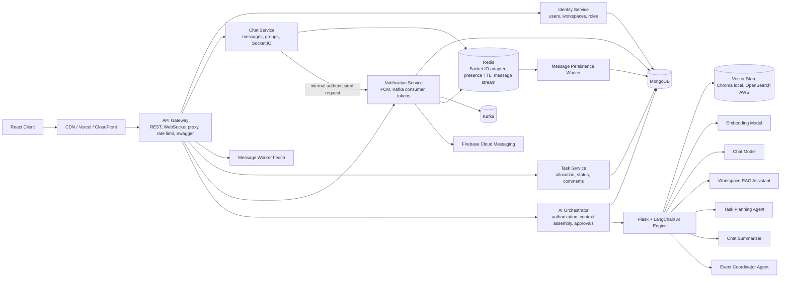
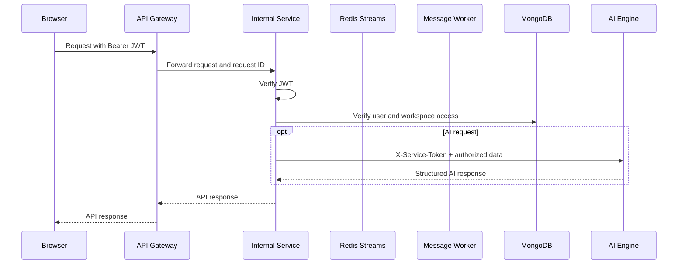
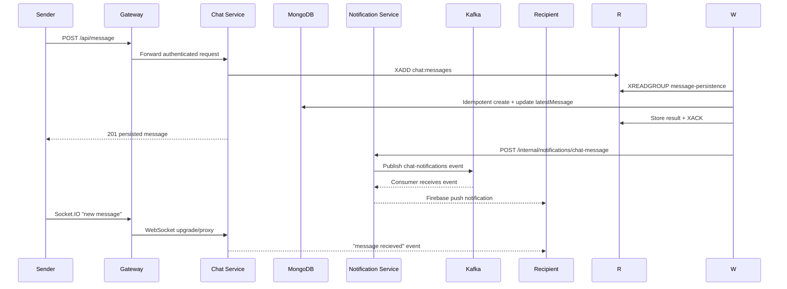
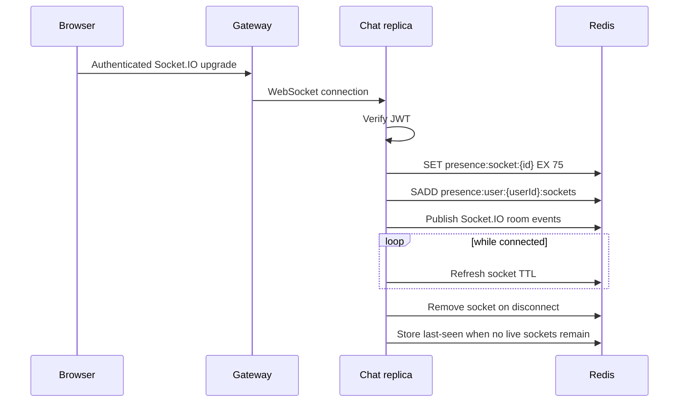
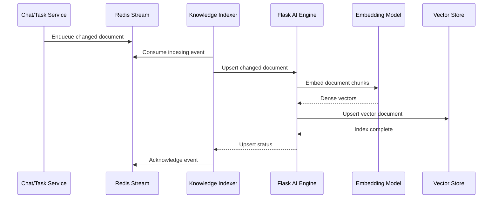
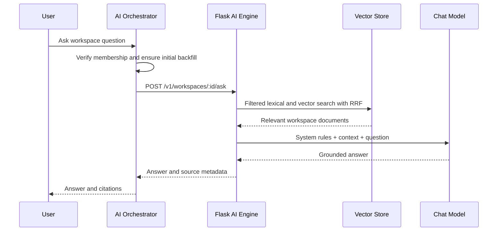
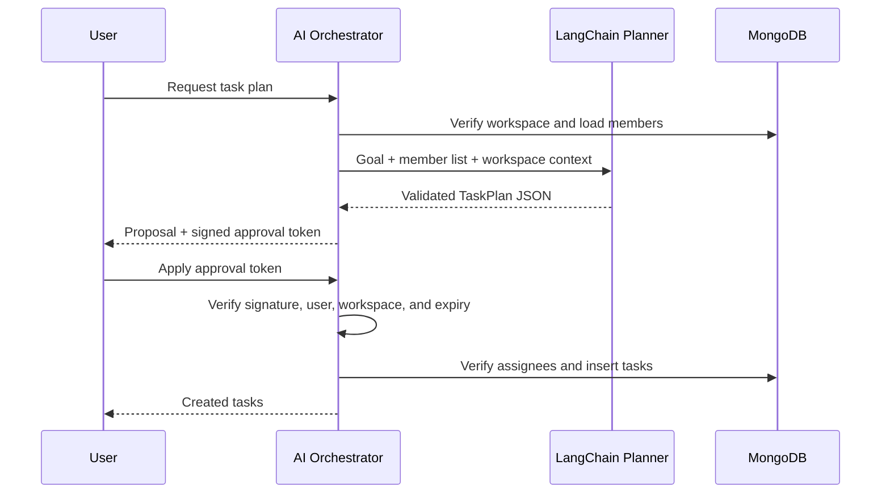
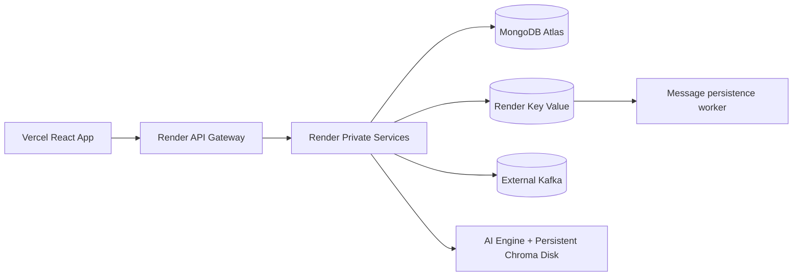
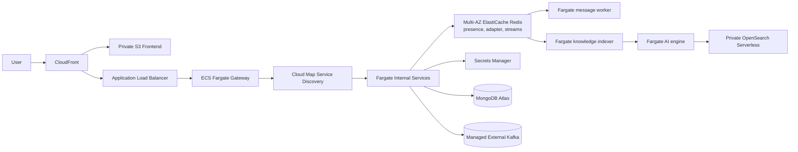

# ComConnect Production Architecture

This guide describes the implemented ComConnect architecture, the interaction
between components, and the operational model for local, Render/Vercel, and AWS
deployments.

## 1. Architecture Goals

ComConnect is an event collaboration application with:

- workspace membership and roles
- group and direct chat over REST and Socket.IO
- task allocation and status tracking
- Kafka-backed push notification delivery
- workspace-scoped retrieval augmented generation (RAG)
- an approval-gated task planning agent
- group chat summarization
- an event coordinator agent

The codebase is a monorepo microservices system. Shared backend modules stay in
one repository, but every service has its own Dockerfile, image, container,
health check, logs, scaling policy, and release artifact. The Node services
currently share one MongoDB cluster, but each service owns a bounded API and can
be scaled or deployed separately.

On AWS, every service has its own ECR repository, ECS task definition, desired
count, maximum count, and CPU target-tracking policy. Chat and message workers
can therefore scale independently from identity, tasks, notifications, and AI.

## 2. Complete System Diagram



Only the API gateway is public. Internal services are addressed by service name
on the Docker, Render private, or AWS Cloud Map network.

## 3. Service Catalog

| Service | Local port | Responsibilities | Primary dependencies |
| --- | ---: | --- | --- |
| API gateway | 5000 | Routing, rate limiting, CORS, security headers, Swagger, WebSocket forwarding, aggregate health | All internal services |
| Identity service | 5101 | Registration, login, users, workspaces, membership, roles | MongoDB |
| Chat service | 5102 | Chats, messages, groups, Socket.IO rooms and broadcasts | MongoDB, notification service |
| Message persistence worker | 5106 | Redis Streams consumer group, idempotent message writes, latest-message updates, dead-letter handling | Redis, MongoDB, notification service |
| Knowledge indexer | 5107 | Redis Streams consumer, incremental embedding upserts, dead-letter handling | Redis, AI engine |
| Task service | 5103 | Task assignment, status, comments, workspace task queries | MongoDB |
| Notification service | 5104 | FCM tokens, Kafka producer/consumer, Redis token cache, push delivery | MongoDB, Redis, Kafka, Firebase |
| AI orchestrator | 5105 | JWT and workspace authorization, source document assembly, task-plan approvals | MongoDB, AI engine |
| AI engine | 5001 | Hybrid RAG, tool-using agents, structured AI outputs | Chroma/OpenSearch, embedding model, chat model |
| Frontend | 3000 | Responsive workspace, chat, task, RAG, planner, summary, and coordinator UI | API gateway |

Service entry points live in `backend/microservices`. Service-specific
Dockerfiles live in `backend/dockerfiles`. `backend/server.js` remains a compact
all-in-one compatibility process for direct development, while Docker Compose
and production deployments run separate images for the bounded services.

## 4. Gateway Contract

The gateway maps public paths to internal services:

```js
addProxy("/api/user", services.identity);
addProxy("/api/workspace", services.identity);
addProxy("/api/chat", services.chat);
addProxy("/api/message", services.chat);
addProxy("/api/tasks", services.tasks);
addProxy("/api/notification", services.notifications);
addProxy("/api/ai", services.ai);
```

Socket.IO traffic on `/socket.io` is forwarded to the chat service with upgrade
support. Chat replicas share rooms through the Socket.IO Redis adapter. Swagger
UI is available at `/api-docs`, and the machine-readable contract is available
at `/openapi.json`.

Operational endpoints:

```text
GET /health
GET /health/services
GET /api-docs
GET /openapi.json
```

## 5. Authentication and Trust Boundaries



Important boundaries:

- The browser never calls the Flask AI engine directly.
- The AI engine receives authorized workspace data, not database credentials.
- Chat-to-notification calls require `X-Service-Token`.
- AI task plans cannot write to MongoDB. A signed approval token must be
  returned by the browser before the orchestrator creates tasks.
- Destructive `deleteAll` development routes are not exposed.

## 6. Chat and WebSocket Workflow



Failed message events are copied to `chat:messages:dead-letter` before being
acknowledged. `streamEventId` is unique in MongoDB, so a reclaimed or retried
stream event cannot create a duplicate message.

The Kafka producer and consumer use the same configurable topic,
`chat-notifications`. If Kafka is unavailable, notification delivery falls
back to direct FCM delivery.

### WebSocket Presence and Horizontal Scaling



The presence API exposes single and batch checks. Expiring socket keys recover
from crashed replicas, while the Redis adapter lets any chat replica deliver to
a user room owned by another replica.

## 7. Workspace Role Channels

Workspace creation is intentionally linear: each role creates exactly one
predefined channel. For roles `Logistics`, `Catering`, and `Registration`, the
system creates three channels with those names. It does not create pair or
triple combinations. Joining a role adds the member only to that role channel.

## 8. Workspace-Scoped RAG

### Sources

The orchestrator builds documents from:

- workspace name and roles
- workspace chat messages and sender names
- task titles, descriptions, assignees, status, priority, and comments
- attachments can be added later by converting supported files to documents

MongoDB remains the business source of truth. Local embeddings are stored in
Chroma; AWS production embeddings are stored in OpenSearch Serverless.

### Indexing



Local Chroma uses one collection per workspace. AWS uses one managed collection
with mandatory `workspace_id` filters. Node authorization remains the first
isolation boundary.

Example document:

```json
{
  "id": "task-665f...",
  "content": "Task: Confirm venue booking\nStatus: to-do\nAssignee: Priya",
  "metadata": {
    "type": "task",
    "source_id": "665f...",
    "label": "Confirm venue booking"
  }
}
```

### Query and Answer



The prompt treats retrieved messages and tasks as untrusted content and asks the
model to answer only from retrieved evidence.

## 9. Task Planning Agent

The planner accepts a goal such as "Plan the registration desk setup" and
returns validated structured tasks.



The Pydantic schema limits output size and requires task fields. The agent can
propose work but cannot claim it created or completed work.

## 10. Chat Summarizer

The `Summarize Chat` control is available in group chat headers. The output is
structured as:

```json
{
  "short_summary": "The team confirmed the venue and discussed catering.",
  "action_items": ["Asha will confirm the final menu."],
  "unresolved_questions": ["Is projector rental included?"],
  "people_mentioned": ["Asha", "Ravi"],
  "deadlines": ["Menu confirmation by Friday"]
}
```

The orchestrator verifies that the current user can access the chat, loads the
messages, and sends only that chat transcript to the AI engine.

## 11. Event Coordinator Agent

The coordinator combines task state, chat activity, and workspace membership to
answer:

- Are we ready for the event?
- What is blocked?
- Who has too many tasks?
- Which tasks need follow-up?

It produces readiness, blockers, workload concerns, follow-ups, and evidence.
It is advisory and does not modify tasks.

## 12. Data Ownership

The current migration-safe design uses a shared MongoDB cluster and shared
Mongoose model package. Logical ownership is:

| Data | Owner |
| --- | --- |
| Users, workspaces, roles | Identity service |
| Chats and messages | Chat service |
| Message ingestion and persistence | Message persistence worker |
| Tasks and comments | Task service |
| FCM tokens and delivery state | Notification service |
| Vectors and AI retrieval metadata | AI engine |

The next isolation step is database-per-service or schema-per-service with
events for cross-service projections. The gateway and runtime split means that
change does not require changing frontend API paths.

## 13. Local Runtime

```bash
docker compose up --build
docker compose ps
```

URLs:

- frontend: `http://localhost:3000`
- API gateway: `http://localhost:5000`
- Swagger: `http://localhost:5000/api-docs`
- aggregate service health: `http://localhost:5000/health/services`
- AI engine direct health: `http://localhost:5001/health`

## 14. Deployment Architectures

### Render and Vercel



`render.yaml` creates the gateway, private services, Redis-compatible key value,
and the AI disk. Vercel builds the React app from `vercel.json`.

### AWS



Terraform is in `infra/aws`. CloudFront forwards `/api/*` and `/socket.io/*` to
the ALB, so the frontend can use one HTTPS origin.

## 15. CI/CD

- `ci.yml`: Node syntax checks, frontend build, Flask tests, Compose validation,
  Terraform formatting and validation.
- `deploy-render-vercel.yml`: production Vercel deployment and Render deploy
  hooks.
- `deploy-aws.yml`: OIDC authentication, ECR bootstrap, image build/push,
  Terraform apply, S3 frontend sync, and CloudFront invalidation.

See `docs/deployment-guide.md` for required secrets and rollout commands.
