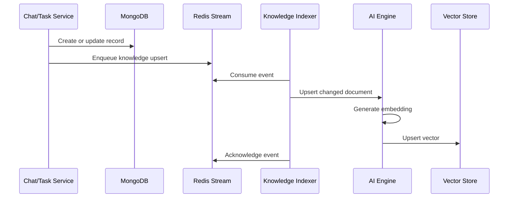
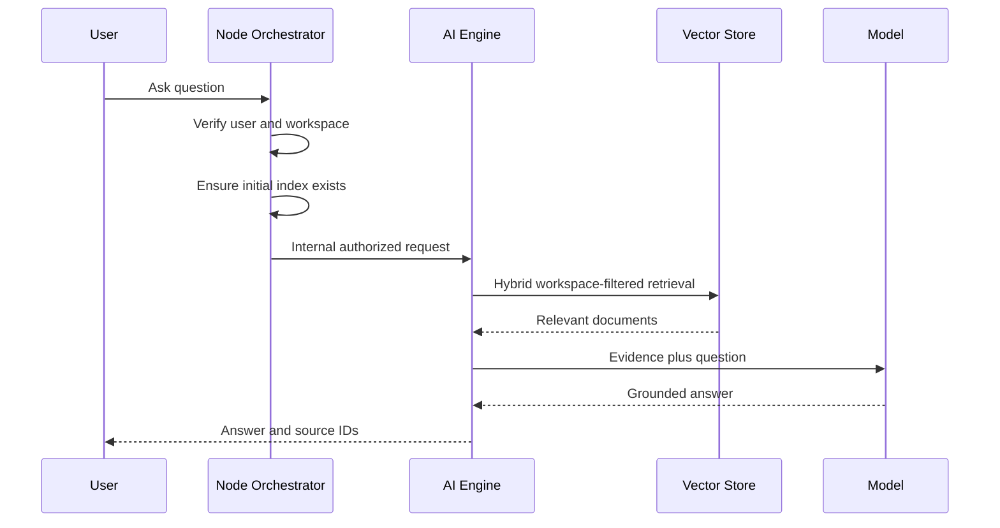
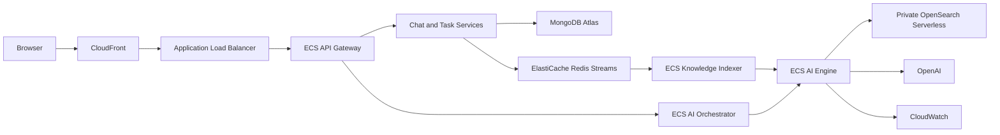

# ComConnect AI, RAG, and Agent Architecture

This is the canonical guide to the AI features in ComConnect. It is written for
engineers who are new to RAG, embeddings, vector databases, and agents.

## 1. System Overview

ComConnect provides:

1. Workspace question answering grounded in messages and tasks.
2. Workspace search using keywords, tags, and semantic similarity.
3. A task-planning agent that researches the workspace and drafts tasks.
4. A group-chat summarizer.

The Node AI orchestrator owns authentication, workspace authorization, MongoDB
data, signed approvals, and business writes. The private Python AI engine owns
embeddings, retrieval, prompts, LangChain agents, structured model output, and
vector-store access.

## 2. RAG In Plain English

An LLM does not automatically know private workspace data. Retrieval-augmented
generation gives the model selected evidence at request time:

```text
question
  -> retrieve relevant workspace records
  -> place those records in the prompt
  -> generate an answer from that evidence
  -> return the answer and source IDs
```

RAG does not retrain the model.

Important terms:

- **Document:** searchable text made from a message, task, or workspace.
- **Embedding:** a numeric representation of meaning.
- **Vector search:** finding documents with meanings close to the query.
- **Lexical search:** word and phrase search, commonly BM25.
- **Metadata filter:** a strict condition such as workspace, tag, or type.
- **Fusion:** combining multiple ranked candidate lists.
- **Grounding:** requiring answers to be supported by supplied evidence.

## 3. Data Ownership And Isolation

MongoDB is the business source of truth. The vector store is a derived search
index that can be rebuilt.

Indexed records contain:

- `workspace_id`
- source type and source ID
- chat ID when applicable
- label, tags, and timestamp
- searchable content
- embedding vector

Node verifies JWT authentication and workspace membership before calling the AI
engine. Production retrieval also applies `workspace_id` as a mandatory vector
store filter. Both checks are required.

## 4. Vector Stores

The backend is selected with `VECTOR_STORE_BACKEND`.

### Local Development

Docker Compose uses Chroma:

```text
VECTOR_STORE_BACKEND=chroma
CHROMA_DIR=/data/chroma
```

Each workspace has a separate Chroma collection and Docker mounts a persistent
volume. This is inexpensive and simple for local development.

### AWS Production

AWS uses private OpenSearch Serverless:

```text
VECTOR_STORE_BACKEND=opensearch
OPENSEARCH_ENDPOINT=https://...
OPENSEARCH_INDEX=comconnect-knowledge
```

Terraform creates a vector-search collection, VPC endpoint, encryption policy,
private network policy, AI-specific task role, and data-access policy.

OpenSearch is selected for AWS because it supports shared durable storage,
metadata filtering, lexical search, vector search, and horizontal AI-engine
scaling. Embedded Chroma storage inside a Fargate task does not provide those
properties.

## 5. Knowledge Ingestion

Earlier code rebuilt and re-embedded the complete workspace during normal
questions. The current design indexes writes incrementally:



Events are emitted for workspace changes, new messages, task creation, task
status updates, comments, and approved agent-created tasks.

Failures go to `workspace:knowledge:dead-letter`. MongoDB writes remain valid
even when indexing is temporarily unavailable.

### Initial Backfill

Existing workspaces need one full index. `WorkspaceKnowledgeState` records that
the backfill completed, so a process restart does not trigger another rebuild.

The explicit endpoint is:

```text
POST /api/ai/workspaces/:workspaceId/sync
```

The first AI request can perform a missing backfill, but production deployment
should backfill existing workspaces before opening traffic.

### Consistency Tradeoff

Incremental indexing is eventually consistent. A new message may take a short
time to become semantically searchable. This is preferable to making every user
write wait for an external embedding request.

## 6. Search And RAG Are Different

Workspace search returns records. Workspace question answering generates a
natural-language answer.

### Workspace Search

For a query or tag filter, search uses:

- MongoDB case-insensitive text matching
- stored tags
- hashtags found in content
- semantic retrieval through the AI vector store
- RRF merge and deduplication

If vector retrieval fails, the database results still work. Empty search still
returns recent exact workspace history without calling the vector store.

`WORKSPACE_RAG_MESSAGE_THRESHOLD` remains in the response for compatibility and
debugging, but it no longer gates semantic search.

### Production Hybrid Retrieval

The OpenSearch backend runs:

1. lexical search over label, tags, and content
2. semantic k-nearest-neighbor search over embeddings
3. strict workspace and optional tag/type filters
4. Reciprocal Rank Fusion (RRF)

```text
RRF score = sum(1 / (RRF_K + rank))
```

RRF combines ranks because BM25 scores and vector scores are not directly
comparable.

## 7. Workspace Question Answering

Question answering always uses RAG:



The prompt requires the model to use supplied evidence, admit missing evidence,
cite source numbers, and ignore instructions embedded inside retrieved records.
Retrieved workspace content is always treated as untrusted.

## 8. What Makes The Agents Agents

The task planner uses LangChain `create_agent` with real tools. The model can
choose tools, inspect results, call more tools, and then produce a structured
response.

### `search_workspace_knowledge`

Searches messages and tasks through the hybrid retrieval layer.

### `list_workspace_tasks`

Reads structured tasks filtered by status, assignee, or tag. Exact business
facts should come from structured data when possible.

### `inspect_member_workload`

Deterministically counts to-do, in-progress, completed, and open high-priority
tasks for a workspace member.

### `draft_task`

Creates a validated in-memory task draft. It verifies workspace membership,
priority, schema limits, duplicates, and the maximum task count.

It does not write to MongoDB.

## 9. Controlled Execution

Unrestricted LLM database tools are not appropriate here. ComConnect separates
agent reasoning from business execution:

```text
agent researches
  -> agent calls draft_task
  -> backend validates drafts
  -> backend signs a 30-minute approval token
  -> user reviews and approves
  -> backend verifies token, user, workspace, and assignees
  -> backend writes MongoDB
  -> index event is emitted
```

The signed token contains the exact executable tasks and a one-time execution
ID. Replaying an already executed token returns `409` instead of creating
duplicate tasks. The model cannot change the payload after approval is issued.

This is a real agent design with a controlled action boundary. Production agents
do not need unrestricted autonomy; constrained tools and explicit approval are
usually safer and easier to audit.

## 10. Task Planning Agent

The agent receives the request and member list. It should:

1. Search workspace evidence.
2. Inspect existing tasks to avoid duplication.
3. Inspect member workload before assignment.
4. Call `draft_task` for every proposed action.
5. Return a concise structured plan.

The tool-generated draft list is authoritative for execution. Final model text
cannot introduce additional executable tasks.

## 11. Chat Summarizer

The group-chat summarizer is not RAG and is not a tool-using agent. It sends the
latest 200 messages to a structured prompt and extracts:

- short summary
- action items
- unresolved questions
- people
- deadlines

For very long chats, a future production extension should summarize batches and
then summarize those summaries.

## 12. AWS Architecture



AWS responsibilities:

- CloudFront delivers the frontend and API routes.
- The ALB exposes the gateway.
- Cloud Map resolves internal services.
- ECS Fargate runs stateless services.
- ElastiCache carries message and knowledge streams.
- OpenSearch stores durable searchable knowledge.
- Secrets Manager supplies keys and internal tokens.
- ECR stores service images.
- CloudWatch stores logs and container metrics.

## 13. Benefits And Tradeoffs

### OpenSearch Serverless

Pros:

- durable managed storage
- hybrid lexical/vector search
- strict metadata filters
- private VPC access
- supports multiple AI-engine tasks

Cons:

- higher minimum cost than local Chroma
- more IAM and network configuration
- mapping and embedding dimensions must be versioned

### Incremental Indexing

Pros:

- lower query latency
- lower embedding cost
- retries and dead-letter handling
- independent worker scaling

Cons:

- eventual consistency
- event replay and ordering need monitoring
- old data requires backfill

### Tool-Using Agents

Pros:

- iterative evidence gathering
- deterministic business tools
- enforceable tool-level rules
- auditable approval boundary

Cons:

- more model calls and latency
- higher cost than one-shot prompts
- requires tool-loop timeouts and tests
- incorrect tool choice remains possible

## 14. MLOps And LLMOps

Production telemetry should include:

- request ID and feature name
- prompt and model versions
- embedding model and dimensions
- index schema version
- tools called and tool-call count
- retrieved source IDs and ranks
- retrieval, tool, and model latency
- token use and estimated cost
- approval or rejection outcome
- index lag and DLQ size

Do not log raw private messages without an approved retention policy.

Maintain a versioned evaluation set with workspace fixtures, questions, expected
source IDs, answer facts, and forbidden cross-workspace sources.

Measure:

- Recall@K and Precision@K
- Mean Reciprocal Rank
- citation correctness
- answer faithfulness
- duplicate-task rate
- assignment validity
- cross-workspace leakage
- P50/P95 latency
- cost per successful request

Model, prompt, embedding, and retriever changes should pass evaluations before
staging, canary, and production promotion. Changing embedding dimensions
requires a new index or complete re-embedding migration.

## 15. Failure Behavior

- Model unavailable: AI requests fail; normal MongoDB features continue.
- Vector store unavailable: workspace search falls back to MongoDB.
- Indexer failure: event enters the DLQ; source data remains in MongoDB.
- Invalid assignee: `draft_task` rejects the action.
- Changed or expired approval token: backend rejects execution.
- AI task restart: OpenSearch data remains available.

## 16. Remaining Operational Work

The code is production-oriented, but operating it responsibly still requires:

- automated DLQ replay
- CloudWatch alarms for index lag and AI errors
- distributed tracing
- explicit prompt/model/index version fields
- staging OpenSearch integration tests
- a representative RAG evaluation dataset
- delete events when records become deletable
- AI-specific rate limits and token budgets
- scheduled reconciliation/backfill
- idempotency records for approved executions

## 17. Architecture Review Questions

- What freshness delay is acceptable after a new message?
- How are out-of-order indexing events handled?
- How are deleted records removed?
- What is the cost budget per AI request?
- Which queries should use MongoDB instead of semantic retrieval?
- How is cross-workspace isolation tested?
- Which tools require approval?
- What is the embedding migration rollback plan?
- Which metrics prove a retriever is better?

## 18. Code Map

Python:

- `ai-service/app/rag.py`: embeddings, Chroma/OpenSearch, hybrid search, RRF.
- `ai-service/app/agent_tools.py`: tools and draft validation.
- `ai-service/app/chains.py`: assistant, agents, and summarizer.
- `ai-service/app/routes.py`: private AI APIs.
- `ai-service/app/schemas.py`: structured outputs.

Node:

- `backend/controllers/aiControllers.js`: authorization, bootstrap, approvals,
  and execution.
- `backend/services/workspaceKnowledgeService.js`: document construction.
- `backend/services/knowledgeIndexService.js`: incremental index stream.
- `backend/microservices/knowledgeIndexerServer.js`: indexing worker.
- `backend/models/workspaceKnowledgeStateModel.js`: persistent backfill state.

Infrastructure:

- `docker-compose.yml`: local Chroma stack.
- `infra/aws/main.tf`: production OpenSearch and ECS stack.
- `.github/workflows/deploy-aws.yml`: deployment workflow.

## 19. Mental Model

Use MongoDB for exact business facts. Use retrieval for relevant unstructured
history. Use the LLM to synthesize evidence. Use agents when the model must
choose and call several tools. Keep business writes behind deterministic
validation and human approval.
